# Facestagram
* ## Facestagram-android
    https://github.com/hakumaku/Facestagram-android
* ## 핵심내용
    Instagram의 소셜미디어, 구글 캘린더의 스케줄링 기능과 Airbnb의 장소 예약 기능을 합친 복합 SNS.
* ## 기획배경
    소셜 미디어 기능으로 친구들과 자신의 일상을 온라인에서만 공유하는 것에 그치지 않고, 이를 오프라인까지 확장 할 수 있도록 친구들과 스케줄을 공유하고 그 계획을 구체적으로 정할 수 있도록 장소 예약이 가능한 서비스를 제공한다.
* ## 목적
    1. 토종 SNS 서비스 제공 및 세계진출.
    1. 사진을 통한 자신의 일상 공유.
    1. 일정을 공유하고 계획을 구체적으로 정해 오프라인 만남을 추구.
    1. 장소 예약을 할 수 있도록 함.
* ## 개발기간
    2019.11.25 ~ 2019.11.28 (4일)
    애자일 소프트웨어 개발로 빠르게 프로토타입을 내놓는 것을 지향하였음.
* ## 기대효과
    배달의 민족, 요기요 등의 서비스는 최근 급부상하여 큰 이익을 창출하였으나 요식업이나 숙박 등 특정 분야에 치중 되어있어 한계가 있다고 생각됨. 하지만 Facestagram은 이러한 한계를 뛰어넘어 다양한 상업 분야로 진출해 소상공인들과 협력해 더 큰 경제효과를 창출할 것으로 기대한다.
* ## 아키텍쳐
    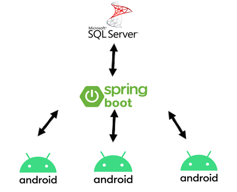
* ## 데이터 베이스
    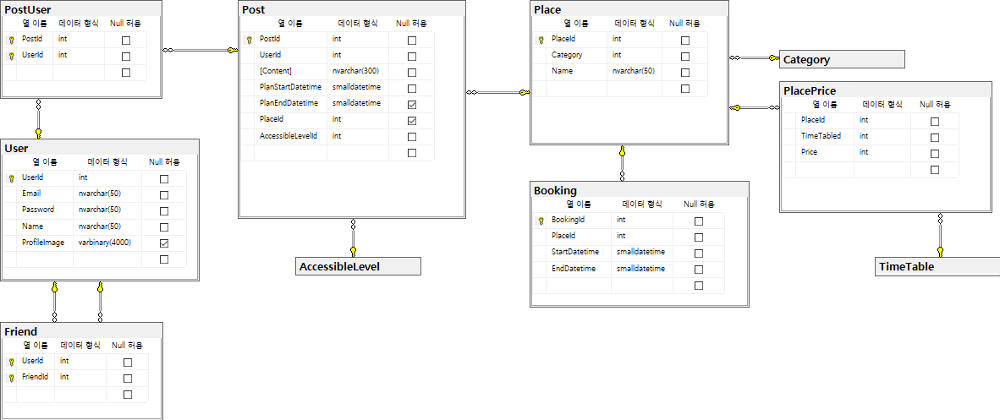
* ## MockUp
    앱을 실행 했을 때 처음으로 나오는 화면. | 자신이 올린 사진, 사진과 관련된 text 리스트.
    :---------------------------:|:---------------------------:
    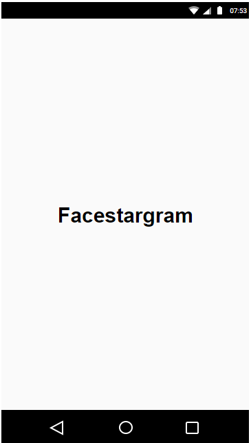 | 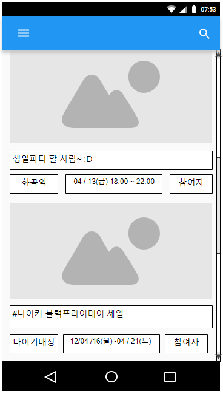
    친구가 게시한 글. | 자신이 공유할 일정 확인.
    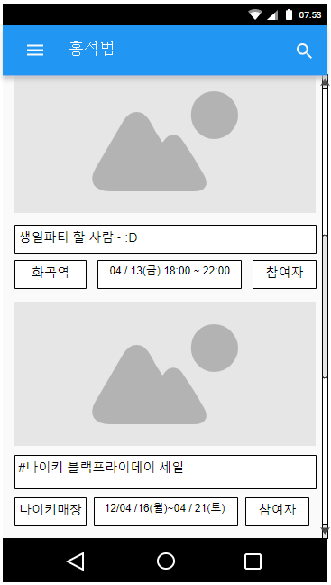 | 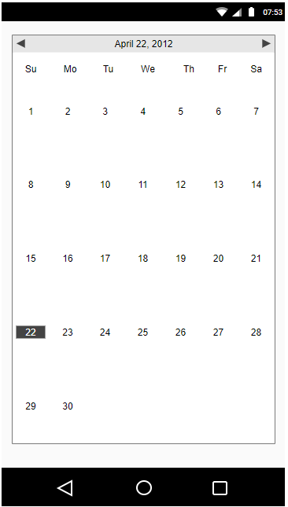
    나의 친구 목록. | 장소 목록.
    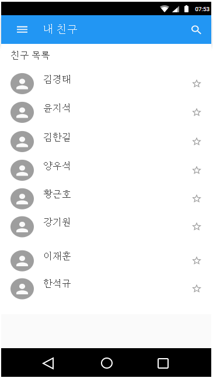 | 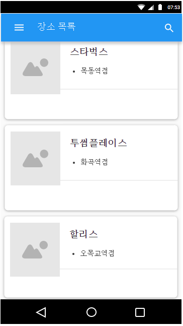
    새로운 글 작성. | 날짜와 장소를 정하고 만남 장소 예약 가능.
    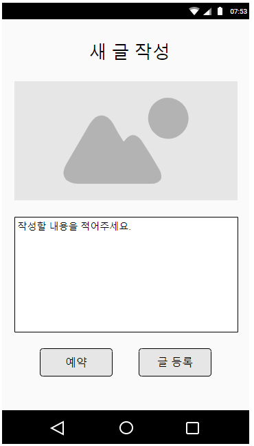 | 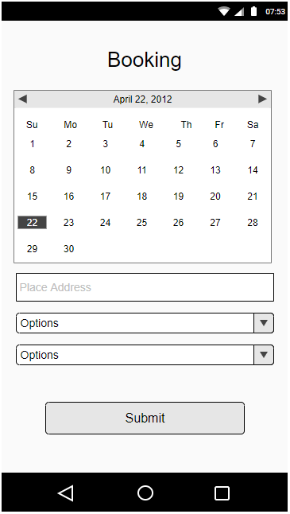
    
# TODO
- [x] 11.26 Mock-up 추가
- [x] 11.26 데이터베이스 추가
- [x] 11.26 테스트
- [x] 11.27 android jsonObject 작동 확인
- [ ] 11.27 앱 ui 구현
- [x] Activity에 필요한 REST url 구현 및 쿼리문
    1. MainActivity
    1. PostlistActivity
    1. CalendarActivity
    1. NewPostActivity
    1. BookingActivity
    1. PlacelistActivity
    1. FriendlistActivity
- [ ] ~~친구 목록~~
- [x]  장소 목록
- [ ] ~~내 달력~~
- [ ] ~~포스트 기능 (생성, 편집, 삭제)~~
- [ ] ~~친구 포스트 보기~~
- [ ] ~~오픈 포스트 보기~~

* ## 기능구현
    처음 시작 화면 | 서버에 저장된 post의 항목을 보여주는 화면
    :---------------------------:|:---------------------------:
    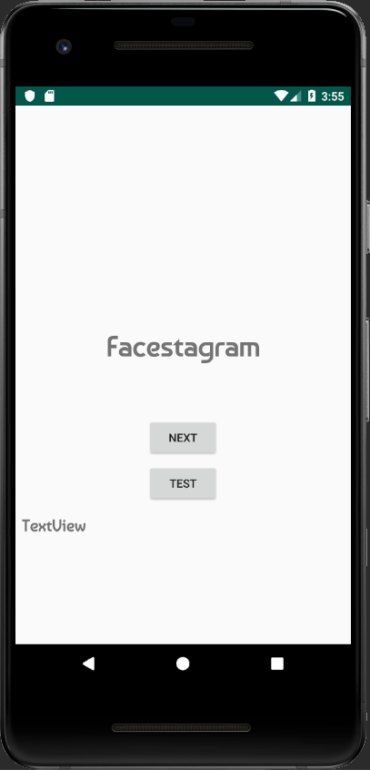 | 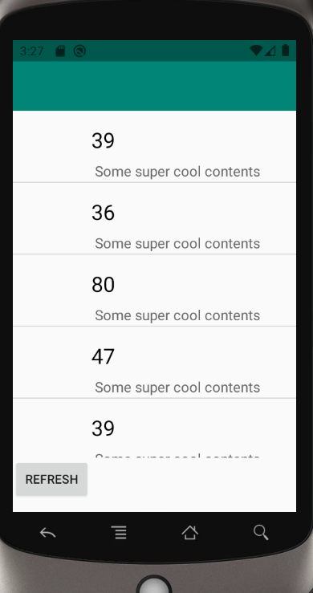
    저장된 장소들의 항목을 보여주는 화면 | 새로운 post 내용을 입력하고 저장 할 수 있는 기능
    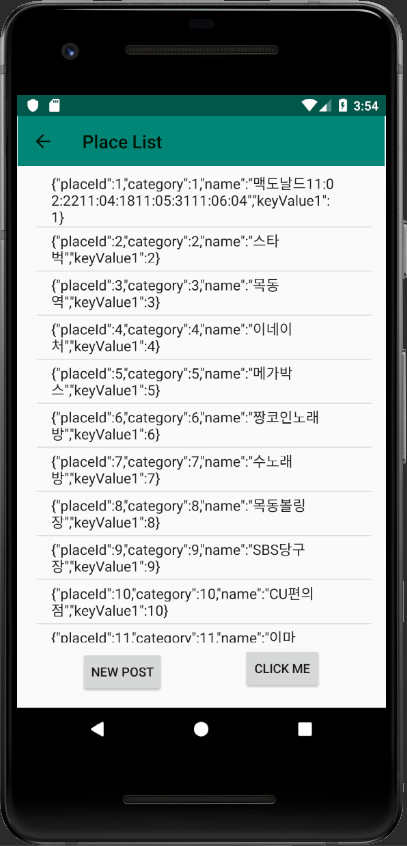 | 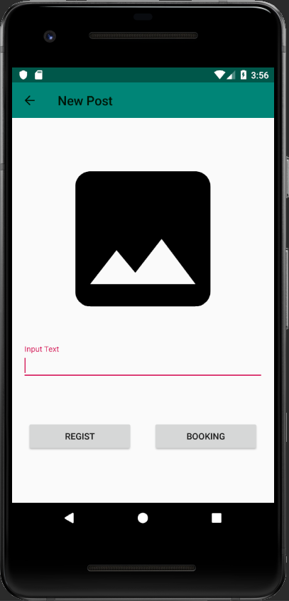
    아직 구현되지 않은 기능 |
    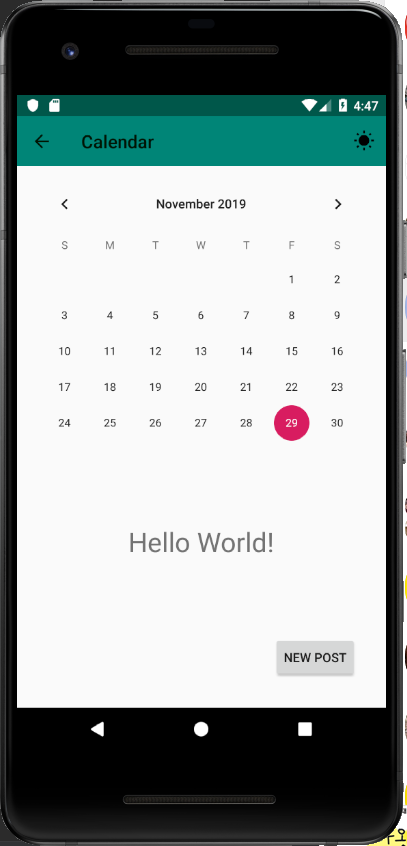 |
    * (미구현) 등록된 일정을 보여주는 화면
    * (미구현) 포스트 (편집, 삭제)
    * (미구현) 친구목록

* ## 한계 및 아쉬웠던 점 (2019.11.29)
    * 안드로이드 버전에 따른 요구되는 설정들이 있었는데, 최초에 이를 파악하지 못해 많은 시간을 소비함.
    * 짧은 기간 내에 안드로이드의 UI를 꾸미는 방법에 대한 이해를 하여야 했으나 그러지 못했다.
    * 비동기적으로 JSON을 서버로부터 받아 오는것과, UI를 업데이트 할 때에는, 메인 스레드에서만 실행되여야 하는 것에 대한 이해하는 데 시간이 많이 소비함.
    * 리스트 뷰의 adapter의 개념도 생소해서 이해하는데 시간이 걸렸다.
    * 급하게 개발하느라 안드로이드의 소스코드들이 분할이 잘 되지도 않았고, 유닛테스트를 구현하지 못해, 디버깅하는데에도 시간이 많이 소비되었다.
    * 안드로이드 에스프레소로 UI 테스트도 하지 못해 디테일 적인 부분은 대부분 신경쓰지 못했다.
    
